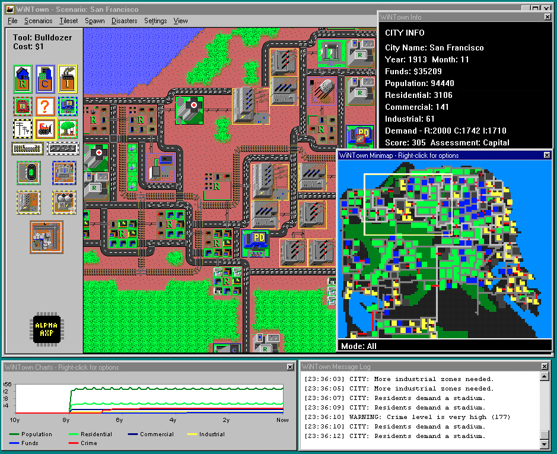

# WinTown

Backport of the classic [Micropolis](https://github.com/SimHacker/micropolis) (aka SimCity) game to Windows (Win32/NT). The primary goal is to make the game playable on NT RISC machines like Alpha AXP, MIPS, PowerPC PPC, Itanium IA64 and ARM.



Download from [Releases](https://github.com/tenox7/WinTown/releases). Note the .exe files are self contained. All assets are baked in as resources. You don't need to download any other files.

--------------

The game is playable but has [bugs](TODO.md).**

PRs welcome!

Special thanks to Neozeed and Roytam for major fixes!

--------------


## Compile for RISC

### ARM

MSVC (2022)

```
C:\Program Files\Microsoft Visual Studio\2022\Community\VC\Auxiliary\Build\vcvarsamd64_armXXX.bat
```

### IA64

Win7 SDK only (not Visual Studio), use `setenv /ia64 /2008 /release`.

For security cookie complain add `/GS-` flag.

### AXP64

PSDK 2000 RC2, aka psdk99, `setwin64.bat`.


## License

WinTown is licensed under the GNU General Public License version 3 (GPL-3.0) with the additional terms per section 7 as established by Electronic Arts when releasing the original Micropolis code as open source. See the [LICENSE](LICENSE) file for the full text.

## Prior art and attribution

WinTown is based on the following prior art and projects:

[SimCity](https://en.wikipedia.org/wiki/SimCity_(1989_video_game)) Created by Will Wright and published by Maxis in 1989. Later ported to Unix platforms by [DUX Software](https://web.archive.org/web/19970714233606/http://www.dux.com/simctyux.html), and finally opensourced by Electronic Arts and released by [Don Hopkins](https://www.donhopkins.com/home/micropolis/) for the [One Laptop Per Child program](https://wiki.laptop.org/go/Micropolis) | [Micropolis](https://github.com/SimHacker/micropolis) | [MicropolisActivity](https://github.com/SimHacker/micropolis/tree/master/micropolis-activity) | [MicropolisCore](https://github.com/SimHacker/MicropolisCore) | [MicropolisJS](https://github.com/graememcc/micropolisJS)

All code and assets from these projects have been used in accordance with their respective licenses, which are primarily GPL-3.0 with the EA additional terms. This project maintains the same licensing terms.
